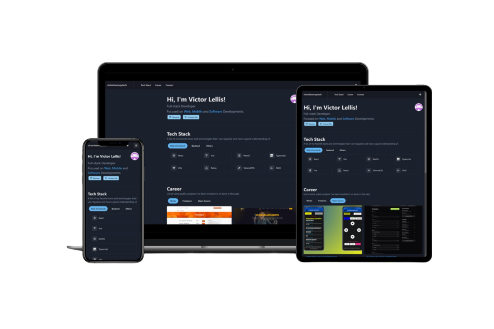

<h2 align="center">
  Portfolio Website<br/>
  <a href="https://victorlwernay.tech" target="_blank">victorlwernay.tech</a>
</h2>
<div align="center">
  
</div>

## 🧪 Technologies

This project was developed using the following technologies:

- [TypeScript](https://www.typescriptlang.org)
- [React](https://reactjs.org)
- [Next.js 14](https://nextjs.org/)
- [Chakra UI](https://chakra-ui.com/)
- [Framer Motion](https://www.framer.com/motion/) (for animations)
- [EmailJS](https://www.emailjs.com/) (for sending emails)

## 🛠️ Features

- Responsive design with a clean and modern UI.
- Dark and light mode support using Chakra UI's color mode management.
- Smooth scroll navigation between sections.
- Contact section with `emailjs` integration.
- SEO optimized with custom metadata and Open Graph tags.

## 🔧 Adjustments and improvements

Next major updates will focus on the following tasks:

- [ ] Add unit tests.
- [ ] Implement multi-language support.
- [ ] Add more animations and transitions with Framer Motion.

## 🚀 Getting started

Clone the project and access the folder.

```bash
$ git clone https://github.com/vWernay/portfoliov2.git
$ cd portfoliov2
```

Follow the steps below:

```bash
# Install the dependencies
$ npm i

# Start the project
$ npm run dev
```

The app will be available for access on your browser at http://localhost:3000.

## 📂 Project Structure

```
src/
├── app/
│   ├── layout.tsx        # Main layout of the application
│   ├── page.tsx          # Home page component
│   ├── theme/            # Theme configurations
│   │   ├── fonts.ts      # Custom fonts
│   │   ├── providers.tsx # Providers for Chakra UI
│   │   └── theme.ts      # Theme configuration for Chakra UI
│   └── components/
│       ├── Header.tsx    # Header component with navigation
│       ├── Footer.tsx    # Footer component
│       └── sections/     # Sections of the home page
│           ├── Introduction.tsx
│           ├── TechStack.tsx
│           ├── Career.tsx
│           └── Contact.tsx
└── public/
    └── assets/           # Static assets like images and icons
```

## 📄 License

This project is licensed under the MIT License.

---

<p align="center">Copyright © 2024 Victor Lellis.</p>
